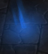
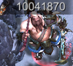

# Snowland & Explorers - мини игра доступная в Event Hall.

## Общая информация
Snowland сбрасывается раз в два дня, Explorers - раз в неделю. Разницы между ними нет, кроме 
цвета фона и длины - Snowland содержит три уровня, а Explorers - пять. Ещё в Explorers постоянно действует один из “бонусов” (каждую неделю разный):
* В бой можно выставить только одного героя, остальные слоты занимают его копии
* К списку героев игрока добавляются 5 прокачанных SSS героев
* При входе в бой у всех героев энергия 100%
* Увеличение скорости атаки на 50%
* В бой можно выставить только одного героя, ему даётся +100% атаки, +100% скорости атаки, +100% HP и 80% сопротивления дебафам

Сама мини-игра заключается в хождении своей группой героев по “подземелью”, собиранию всяких вкусняшек и устранению монстров.
Сложность, по-видимому, зависит от Alert Level и/или Power игрока, в начале игры может быть довольно высокой, чуть
дальше становится проще, к середине игры невыносимо скучной. На каждый следующий уровень переход осуществляется взятием специального сундука.

## Что можно встретить в игре
На карте можно встретить вот такие объекты:

Картинка | Шоэта
--- | ---
 | Обычный сундук с наградой. Содержит одно из<ul><li>монеты</li><li>аметисты</li><li>камни душ (до 50)</li><li>3* куски героев (2-3 штуки)</li></ul>
 | Редкий сундук с наградой. Содержит 2-3 вещи из списка: <ul><li>бриллианты (до 50)</li><li>сундук пророка</li><li>монета желаний</li><li>золото</li><li>аметисты</li></ul>
 | Аметисты. При подборе даёт… аметисты!
 | Золото. Подбираешь и получаешь золото. В количестве пренебрежимо малом, полезном разве что в самом начале игры, когда 10к золота кажется большой суммой.
 | Куски героев. Даёт до 10 кусков случайного 3* или 4* героя.
 | Шарик. При подборе добавляет в Event Hall случайное событие. Или не добавляет, если там уже переполнено.
 | Могила героя. При подборе воскрешает одного своего героя. Можно отменить, нажав кнопку закрытия без выбора героя, тогда могила останется на карте.
 | Грааль. При подборе запускает мини-событие. [Описание событий](#Мини-события в граалях).
 | Свиток. Даёт случайное заклинание, для использования на карте лабиринта. Полезно только в самом начале, когда сложность высока.
 | Особый сундук перехода на следующий уровень. На последнем уровне (3 Snowland, 5 Explorers) после его взятия можно продолжать ходить по карте этого уровня - он не завершает игру.
 | Особый сундук перехода на следующий уровень с увеличением сложности и наград. На последнем уровне (3 Snowland, 5 Explorers) после его взятия можно продолжать ходить по карте этого уровня - он не завершает игру.
 | Особый сундук с наградой не завершающий уровень. Содержимое разнообразное, например может выпасть <ul><li>epic броня</li><li>сундук пророка</li><li>монетка желаний</li><li>heroic summon scroll</li><li>куски оранжевых украшений</li></ul>
 | Тут лежит предмет, но какой - неизвестно. Чтобы увидеть надо подойти ближе.
 | Тут лежит особый сундук, но какой - неизвестно. Чтобы увидеть надо подойти ближе.

Кроме полезных предметов на карте встречаются монстры:

 

Они бывают трёх видов:
 *  самые простые. В Fast Battle награды нет, в “ручном” бою награда смехотворная - 30 Mobility, 40 камней душ, и т.п.
 *  чуть посложнее. Наград в Fast Battle нет, в “ручном” тоже смешные, например 10к золота, 8 веток трансформации, и т.п..
 *  местные боссы. Сложнее простых в 2-5 раз. Около каждого особого сундука стоит такой босс. Чтобы сундук взять, надо победить врагов на всех клеточках вокруг него (8 клеток). Награда за Fast Battle до 40 кусков 4* героя. В “ручном” режиме кусков героя дают столько же и ещё добавляют до 150 бриллиантов.

Хорошая новость: монстров не обязательно убивать. Команда прекрасно проходит сквозь них, просто надо тыкать мышью в поля за ними. Фактически, обязательны к убийству на каждом уровне только моснтры и босс вокруг особого сундука.

После победы над монстром выдаётся одна из трёх карт на выбор. Карты жизненно необходимы в начале игры, полезны чуть позже и абсолютно бесполезны для прокачанных героев, которые валят боссов за две секунды.

Все карты делятся на большие группы:
* Регенерация
  * Восстановление здоровья в секунду в бою
  * Восстановление здоровья после боя
  * Lifesteal - вампиризм
  * бонус к встроенному в героев восстановлению (health recovery)
* Защита
  * бонус к defence
  * сокращение время контроля своих героев
  * бонус к уклонению
  * бонус к блоку
  * бонус к максимуму HP
* Атака
  * бонус к атаке
  * бонус к урону от rage skill
  * бонус к шансу крита
  * бонус к скорости атаки
  * штраф к лечению врагов
* Особые
  * регенерация здоровья команде при смерти героя
  * регенерация энергии команде при убивании врага
  * +80% атаки за -2% HP в секунду в бою

Кроме разделения по бонусам, есть карты которые действуют на всех, на одну расу (например демонов), на один класс (например магов), и на одного героя (например Милюсину). Про ценность тех или иных карт подробнее в [стратегиях прохождения](#Стратегии прохождения).

## Особенности Snowland
На первом уровне около 7 монстров, один босс, один жёлтый сундук с такой наградой:

На втором уровне около 8 монстров, два босса, жёлтый и красный сундуки. В красном лежит что-то такое:

На третьем уровне около 9 монстров, один или два босса, красный сундук, иногда синий. В красном лежит что-то такое:

Итого, полный забег приносит SS героя, 1500 бриллиантов, одну руну, две зелёных карты сокровищ и всякого по-мелочи + что удастся вынести из обычных сундуков и боёв (чаще всего это куски 3*-4* для сборки нескольких героев).

## Особенности Explorers
Уровни в Explorers больше уровней Snowland, но всё работает точно так же. Каждую неделю действует один из бонусов:
* В бой можно выставить только одного героя, остальные слоты занимают его копии
* К списку героев игрока добавляются 5 прокачанных SSS героев
* При входе в бой у всех героев энергия 100%
* Увеличение скорости атаки на 50%
* В бой можно выставить только одного героя, ему даётся +100% атаки, +100% скорости атаки, +100% HP и 80% сопротивления дебафам

На первом уровне около 7 монстров и один босс. Жёлтый сундук с наградой вида:

На втором уровне около 9 монстров и два босса. Жёлтый и красный сундук, в красном:

На третьем уровне около 9 монстров и один босс на красном сундуке. Получить можно:

На четвёртом уровне около 10 монстров и два босса. Сундуки жёлтый и красный, в красном:

На пятом уровне около 15 монстров, два-три босса. Красный сундук и один-два синих. В красном:

Итого, полный забег приносит SSS героя, 1500 бриллиантов, три руны, четыре зелёных карты сокровищ (во время недели с глобальным событием на прохождение карт сокровищ) и всякого по-мелочи + что удастся вынести из обычных сундуков и боёв (чаще всего это куски 3*-4* для сборки нескольких героев).

## Стратегии прохождения
Способы прохождения варьируются в зависимости от сил игрока. Новички это когда на руках есть 5 героев с 5-6* и в рюкзаке два-три . Середняки - те кто уже определился с carry-героем, раскачал его до 10* и далее. Старички - те у кого уже полноценная команда или 16* соло-carry.
### Для новичков в игре
Пройти даже Snowland по жёлтым сундукам может быть невозможно, когда героев мало и они слабые. Имеет смысл сначала оббежать всю карту уровня и собрать на ней все собираемые предметы. Тут же на полученные монеты и аметисты подкачать своего основного героя. Бои будут тяжелы и рандомны, начать стоит с обычных монстров с целью выбить как можно больше карт на выживание/регенерацию.

Также стоит собрать все свободно валяющиеся свитки. Приоритет - регенерация, потом выживание, потом атака, потом всё остальное. Эликсиры использовать в последнюю очередь, когда уже совсем никого не осталось в команде.

Бои с боссами будут основным препятствием, возможно будет иметь смысл выйти из подземелья (прогресс сохранится до резета), заняться другими делами, подкачать героев и попробовать ещё раз. Если эликсир не помог вынести босса, то надо задействовать свитки - открыть меню свитков и перетащить свитки на свою команду на карте или босса (в зависимости от того, на кого свиток действует - часть улучшает свою команду, часть вредит врагам). Однако свитков обычно не много, а бонусы у них не слишком велики, так что надеятся на них не надо, и имеет смысл применять сразу все применимые, так как проигранный бой тоже снимает эффект свитка (если это, конечно не был +/- HP).

В принципе, в состояние “среднего уровня” можно перейти за неделю, так что много здесь не пропустить.

### Для среднего уровня
На среднем уровне сложность уже гораздо ниже, самая приоритетная задача - как можно быстрее обеспечить выживание carry-героя или всей команды. Если используется герой без самостоятельной регенерации (т.е. Милюсина), то сразу надо пойти побить обычных монстров пока не выпадет Lifesteal или регенерация. После этого можно либо набрать других карт (к атаке), или попробовать босса. Если босс легко ложится, то идём дальше, получаем ещё пару-тройку бонусов к атаке и опять босс. По пути можно собирать всё что плохо лежит, но на всякую чушь типа аметистов или монеток уже можно забивать.

Эликсиры скорее всего будут нужны на боссах, но на втором и далее уровнях обычно есть надгробия, позволяющие бесплатно воскресить carry. Имеет смысл их приберегать именно для него, а не растрачивать на других героев.

### Для старичков
Для старичков главная сложность - заставить себя пройти Snowlands или Explorers. Команда обычно не имеет проблем в выносом любых монстров и боссов даже без карт. Поэтому просто пробегаем по вкусняшкам (куски героев и сундуки), убиваем только боссов и тех кто мешает взять главный сундук.

## Мини-события в граалях
Оранжевым отмечены события не содержащие положительных исходов, зелёным - полезные, результат которых влияет не только на текущий лабиринт. Также зелёным выделен наиболее выгодный ответ.

При каждом событии из трёх вариантов ответа на выбор предлагается два, то есть событие может быть и полезным и вредным, в зависимости от выпавших вариантов. Нейтральный вариант (ничего не случается), присутствует, по-видимому, всегда, но если нет ни одного “хорошего” варианта, окошко события можно просто закрыть - ничего не произойдёт.

Все бонусы “к команде присоединяется ...” действуют только на текущий забег по лабиринту.

#### A cow appeared, looking very sad
* Tell a joke to cheer it up - -15% HP
* Attack it - бой с гигантом
* Comfort it - ничего не случается

#### You found a very special notebook with DEAD written on it
* Burn it - ничего не случается
* Write down what you dislike - где-то на карте сдохнет монстр
* Write down the name of your lover: - сдохнет один из своих героев

#### You found a puppet who ask you to help him back home. What will you do?
* Help him -  к команде присоединяется Нуофет
* Fool him - ничего не случается
* Just ignore him - ничего не случается

#### You found a fruit tree with many fruits on.
* Pick fruits to eat - -15% HP
* Shake the tree - даёт один Heroic Summon Scroll
* Stare at the tree - ничего не случается

#### A dragon appeared and said it could fulfil one of your wishes.
* Conquer the world - ничего не случается
* Ask for money - даёт немного денег
* Resurrect your partner - воскрешает одного своего героя

#### A mysterious mage appears in your way. What will you do?
* Magician card - заплатить одну карту, получить случайный предмет
* Just ignore him: - ничего не случается
* Talk to him - к команде присоединяется Маг

#### You noticed a sign pointing to an unknown place.
* Follow the sight - -15% HP
* Ignore the sign - ничего не случается
* Choose the opposite direction - выдаёт случайное украшение (в слот Necklace)

#### There is a beautiful flower growing on the ground.
* Pick it - забирает немного золота
* Just Ignore it - ничего не случается
* Praise its beauty - к команде присоединяется Эльф Сул

#### There is a pond with clear water in your way. you suddenly want to do something here.
* Go swimming - бой с Крабами
* Drink water there - +20% HP на следующий бой
* Piss in the pond - бой с Крабами

#### You found a giant bear ahead. What will you do?
* Say hello - -15% HP
* Attack it - бой с Роудом (Оленем)
* Bypass it: - выдаёт случайное украшение (в слот Necklace)

#### You found a giant boar ahead. What will you do?
* Hide from it - -15% HP
* Watch it - -15% HP
* Ignore it - ничего не случается

#### You found a solid shield, which seems to be the belonging of a Royal Guard.
* Return it back - даёт два камня улучшения предметов
* Sell it - даёт немного золота
* Take it - даёт предмет брони (до Epic)

#### There is a sharp sickle on the ground. What do you do?
* Check it carefully - ничего не случается
* Take it away - даёт предмет брони (до Epic)
* Pick it up: - бой с Чёрной Робой

#### You found a skeleton, who seems to have been dead for days.
* Burn it: - ничего не случается
* Just ignore it - бой со Скелетом
* Turn it over - даёт предмет брони (до Epic)

#### You found a gorgeous wizard robe in the corner.
* Put it on - даёт предмет брони (до Epic)
* Ignore it - ничего не случается
* Burn it - бой с Адским Магом

#### You found a magic lamp. What will you do?
* Polish it - даёт один Heroic Summon Scroll
* Touch it: - ничего не случается
* Knock it: - -15% HP

#### You found a strange treasure chest but had a bad feeling about it.
* Open it with brute force: - даёт предмет брони (до Epic)
* Just ignore it: - ничего не случается
* Use the key: - один герой -50% HP

#### There is a strange stake ahead, what will you do?
* Touch it: - к команде присоединяется Древесный Эльф
* Just Ignore it: - -15% HP
* Cut it off - даёт среднее количество дерева

#### You encounter a lost Imp. What will you do?
* Attack him - даёт опыт (XP)
* Ignore him - -15% HP
* Take him home - ничего не случается

#### You met a mysterious old man who seemed to want to talk to you.
* Ignore him - даёт один Refine Stone
* Flatter him - даёт сто веток трансформации
* Talk to him - ничего не случается

#### There is a beautiful bow lying on the ground. What will you do?
* Try it out - даёт 4* Некродракона (в виде кусков)
* Break it - бой с Молиан
* Just ignore it - ничего не случается

#### A lonely dog appeared in your way!
* Feed it - забирает немного золота
* Just ignore it - ничего не случается
* Fondle it - даёт немного аметистов

#### You encountered a beggar by the roadside, who looks pathetic...
* Give him money - забирает немного золота
* Give him food - даёт заклинание (для Snowland/Explorers)
* Ignore him - ничего не случается

#### You found a little elf flying in the sky. What will you do?
* Talk to her - даёт три монетки желаний
* Praise her - к команде присоединяется Эльф Сул
* Ignore her - ничего не случается

#### A tiger suddenly appeared in your way. What will you do?
* Say hello - к команде присоединяется Тигр
* Hide from him - бой с Тигром
* Attack it - бой с Тигром

#### You found a bunch of strange mushrooms, seems... edible.
* Just inore them - -15% HP
* Smash them - ничего не случается
* Eat them - +30% HP

#### You found a broken statue in the corner. What will you do?
* Destroy it - даёт немного камня
* Sell it - даёт немного золота
* Pee around it - бой с Гаргулей

#### You found a very special book. Who left it here?
* Take it away - даёт один Heroic Summon Scroll
* Open it: - бой с Магом
* Tear it up - -15% к атаке на следующий бой

#### You found a bonfire ahead. Who was there just now?
* Investigare it: - ничего не случается
* Put it out: - -15% HP
* Warm yourself - +20% HP

#### There is a strange pile of stones in your way. Is it an illusion?
* Touch them - бой с Големом
* Plant flowers around - к команде присоединяется Голем
* Destroy them with brute force - бой с Големом

## Баги
Иногда генератор карт ставит объект в недоступное место, или даже стартовая позиция персонажа не связана с остальной картой. Если проблема критическая (персонаж или особый сундук заблокирован), можно написать в официальный дискорд, там помогут. Если заблокирован какой-то шлак, то просто его игнорируем и идём дальше.

Если после боя с монстром начать тыкать в карту под вот таким экраном: 

и нечаянно попасть в другого монстра, то есть хороший шанс зависания клиента. На экране будет сразу два экрана выбора карт ни один из которых не будет реагировать на мышь. Лечится закрыванием игры или быстро-быстро взять карту из первого выбора, пока идёт бой со вторым монстром.
